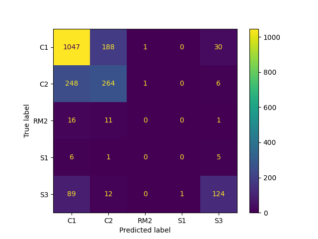

# Building Structure Type Prediction: Based on Area, Floors, Footprint, and POI Information

[中文文档](README_CN.md) | English

## Introduction
---

In various maps, building footprint and height data are common or easily obtainable from high-resolution satellite imagery. However, building structure types, which are essential data for structural performance analysis, are difficult to acquire. Although some studies [1-2] have developed related prediction models, their data has not been made publicly available.

This project develops a random forest-based model for predicting building structure types (concrete frame, shear wall, steel frame, etc.) based on building floor area, number of floors, building footprint, and surrounding Points of Interest (POI) information.

We manually extracted data for 2121 buildings from publicly available data in Wuhan, China. Most of these are common building types in Chinese cities: concrete frame (C1), concrete shear wall (C2, commonly residential), and light steel structure (S3, commonly industrial). Both the training data and the trained models are fully available in this repository.

## Installation
---

```bash
# Create a Python 3.12 virtual environment named bldstructpred
conda create -n bldstructpred python=3.12

# Activate the environment
conda activate bldstructpred

# Install the BldStructPred package
pip install BldStructPred
```

## Random Forest Model
---

### Training Data

Training dataset: `data/武汉建筑训练数据_POI_LJJ.csv` (Wuhan Building Training Data with POI)

Data source: Building data from Wuhan, collected through manual annotation ([Original data source](https://data.wuhan.gov.cn/page/data/data_set_details.html?cataId=380658ec927a4be29e98638f1ff00572)).

POI classification data: `data/高德POI分类与编码（中英文）_V1.06_20230208.xlsx` (Amap POI Classification and Encoding in Chinese and English).

### Input

- Floor area
- Number of floors
- Footprint coordinates
- POI (optional): The distances of the 20 nearest POIs categorized as 'Residential Services' or 'Business Residential' within a 2km radius of the building (obtainable through Amap POI service)

### Output

- Structure type: Building structure classification according to Hazus [3], e.g., C2 for concrete shear wall structures, S3 for light steel structures.

### Model Performance

The random forest model trained using area, floors, footprint, and POI information achieves an overall accuracy of around 80%. The confusion matrix is shown below:



The feature importance is shown below. Besides area and number of floors, POI information is also significant. For example, if residential buildings are distributed nearby, the building in question is likely also residential. In China, residential buildings are typically concrete shear wall structures, so POI information contributes significantly to the model.


Without POI data, the overall accuracy drops to 73%. The confusion matrix without POI data is shown below:


## Usage
---

### Model Training

Refer to the code in `Examples/Example1.py` for model training:

```python
from BldStructPred.StructPred import StructPred_RF

# Set training data file path and parameters
DATA_FILE = 'data/武汉建筑训练数据_POI_LJJ.csv'
N_VERT = 100  # Number of footprint vertices
N_POI = 20    # Number of POIs

# Create and train the model
clf = StructPred_RF(DATA_FILE, N_POI, N_VERT)
clf.train()

# Evaluate model performance
clf.evaluate()

# Visualize confusion matrix and feature importance
clf.plot_confusion_matrix()
clf.plot_feature_importance()
```

### Using the Trained Model for Prediction

Refer to the code in `Examples/Example2.py` for using the trained model for prediction:

```python
from pickle import load
from pathlib import Path

# Load the trained model
with open('data/TrainedRF.pkl', "rb") as f:
    clf = load(f)

# Prepare building data
Area = [32000, 500]                           # List of building areas
Floor = [4, 10]                               # List of floor numbers
Footprint = [[(-80, -100), (80, -100), (80, 100), (-80, 100)],  # List of footprint coordinates
             [(-12.5, -10), (12.5, -10), (12.5, 10), (-12.5, 10)]]
             
# POI data: [[Distance, Category1, Category2, Category3], ...]
POI = [[[443.6, '商务住宅', '住宅区', '住宅小区']], 
       [[294.7, '商务住宅', '住宅区', '住宅小区']]]

# Predict building structure types
result = clf.predict(Area, Floor, Footprint, POI)
print(result)
```

## References
---
[1] Peng Zhou, Yuan Chang. Automated classification of building structures for urban built environment identification using machine learning. Journal of Building Engineering, 2021, 43: 103008.

[2] Zhen Xu, Yuan Wu, Ming-zhu Qi, Ming Zheng, Chen Xiong, Xinzheng Lu. Prediction of Structural Type for City-Scale Seismic Damage Simulation Based on Machine Learning. Applied Sciences, 2020, 10(5): 1795.

[3] FEMA. Hazus Inventory Technical Manual. Hazus 4.2 SP3. FEMA, 2021.

## How to Cite
---

If you use BldStructPred in your research, please cite it as follows:

```bibtex
@software{you_ke_liu_2025,
  author       = {You, Tian and Ke, Ke and Liu, Jiajie},
  title        = {youtian95/BldStructPred: v0.1.0},
  month        = may,
  year         = 2025,
  publisher    = {Zenodo},
  version      = {v0.1.0},
  doi          = {10.5281/zenodo.15342789},
  url          = {https://doi.org/10.5281/zenodo.15342789}
}
```

Or in text format:

You, T., Ke, K., & Liu, J. (2025). youtian95/BldStructPred: v0.1.0 (v0.1.0). Zenodo. https://doi.org/10.5281/zenodo.15342789
