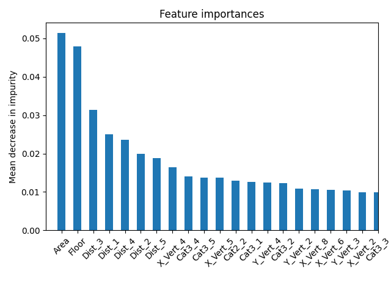
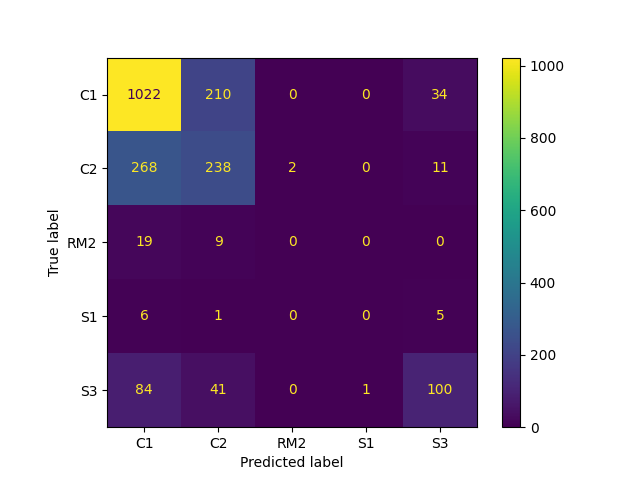

# 建筑结构类型预测：根据面积、层数、轮廓、POI基本信息

## 介绍
---

在各类地图中，建筑群的轮廓和高度等数据很常见，或者容易从高清卫星地图中获取，但是建筑的结构类型作为进行建筑结构性能分析的常用数据，却很难获得。虽然一些文献[1-2]中做了相关的预测模型研究，但是数据并未公开。

本项目开发了一个基于随机森林算法的建筑结构类型预测模型，可根据建筑的平面面积、层数、建筑轮廓和周边兴趣点(POI)信息预测建筑的结构类型(混凝土框架、剪力墙、钢框架等)。

从武汉的公开数据中手动提取了2121幢建筑的数据，大部分是国内城市常见类型：混凝土框架（C1）、混凝土剪力墙（C2，常为住宅）和轻钢结构（S3，常为工业厂房）。训练数据和训练好的模型都完全在本仓库中公开。

## 安装
---

```bash
# 创建名为bldstructpred的Python 3.12虚拟环境
conda create -n bldstructpred python=3.12

# 激活虚拟环境
conda activate bldstructpred

# 安装BldStructPred包
pip install BldStructPred
```

## 随机森林模型
---

### 训练数据

训练数据集：`data/武汉建筑训练数据_POI_LJJ.csv`

数据来源：武汉市建筑数据，通过人工标注收集而成（[原始数据来源](https://data.wuhan.gov.cn/page/data/data_set_details.html?cataId=380658ec927a4be29e98638f1ff00572)）。

POI分类数据：`data/高德POI分类与编码（中英文）_V1.06_20230208.xlsx`。

### 输入

 - 平面面积
 - 层数
 - 轮廓结点坐标
 - POI（可选）：该建筑周围半径2公里范围内最近的20个属于'住宅服务'或者'商务住宅'的距离（根据高德地图POI获取功能可以得到）

### 输出

 - 结构类型：Hazus[3]中的结构分类，例如，C2为混凝土剪力墙结构，S3为轻型钢结构。

### 模型性能

根据面积、层数、轮廓、POI训练得到随机森林模型，整体的准确性为80%左右。混淆矩阵如下：


各个特征的重要性如下。可以发现，除了面积和层数之外，POI信息也是很重要的。例如，如果住宅建筑分布在周围很近，那么说明这幢建筑也很有可能是住宅，而在国内住宅常常是混凝土剪力墙，所以POI信息对模型由很大的贡献。



当不用POI数据时，整体准确性降低到73%。混淆矩阵如下：



## 使用方法
---

### 模型训练

可参考`Examples/Example1.py`中的代码进行模型训练。

### 使用训练好的模型进行预测

可参考`Examples/Example2.py`中的代码使用训练好的模型进行预测：

```python
from joblib import load
from pathlib import Path
import numpy as np
import BldStructPred

# Load the trained model
data_dir = Path(BldStructPred.__file__).parent / 'data'
np_version_obj = version.parse(np.__version__)
if np_version_obj < version.parse('1.27.0'):
    TRAINED_RF = data_dir / 'TrainedRF_numpy_v_1_26.joblib'
else:
    TRAINED_RF = data_dir / 'TrainedRF.joblib'

# Prepare building data
Area = [32000, 500]                           # List of building areas
Floor = [4, 10]                               # List of floor numbers
Footprint = [[(-80, -100), (80, -100), (80, 100), (-80, 100)],  # List of footprint coordinates
             [(-12.5, -10), (12.5, -10), (12.5, 10), (-12.5, 10)]]
             
# POI data: [[Distance, Category1, Category2, Category3], ...]
POI = [[[443.6, '商务住宅', '住宅区', '住宅小区']], 
       [[294.7, '商务住宅', '住宅区', '住宅小区']]]

# Predict building structure types
clf = load(TRAINED_RF)
Y_test = clf.predict(Area, Floor, Footprint, POI)
print(Y_test)
```

## 参考文献
---
[1] Peng Zhou, Yuan Chang. Automated classification of building structures for urban built environment identification using machine learning. Journal of Building Engineering, 2021, 43: 103008.

[2] Zhen Xu, Yuan Wu, Ming-zhu Qi, Ming Zheng, Chen Xiong, Xinzheng Lu. Prediction of Structural Type for City-Scale Seismic Damage Simulation Based on Machine Learning. Applied Sciences, 2020, 10(5): 1795.

[3] FEMA. Hazus Inventory Technical Manual. Hazus 4.2 SP3. FEMA, 2021.


## 引用本文
---

```bibtex
@software{you_ke_liu_2025,
  author       = {You, Tian and Ke, Ke and Liu, Jiajie},
  title        = {youtian95/BldStructPred: v0.1.0},
  month        = may,
  year         = 2025,
  publisher    = {Zenodo},
  version      = {v0.1.0},
  doi          = {10.5281/zenodo.15342789},
  url          = {https://doi.org/10.5281/zenodo.15342789}
}
```

或者

You, T., Ke, K., & Liu, J. (2025). youtian95/BldStructPred: v0.1.0 (v0.1.0). Zenodo. https://doi.org/10.5281/zenodo.15342789